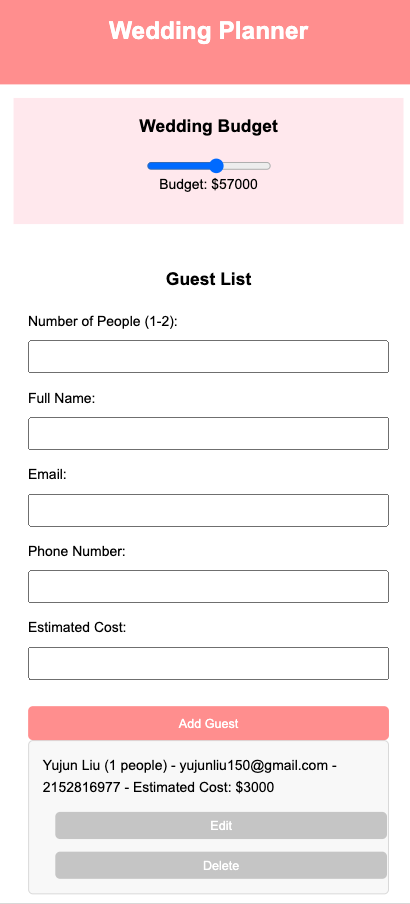

# Wedding Planner 🎉

A web application designed to assist with planning weddings, allowing users to manage their budget, guest list, dinner options, location, and photographer details. This planner helps streamline and organize wedding details in one place.


## Preview




## Features

- **Budget Management**: Adjust the wedding budget with an interactive slider.
- **Guest List**: Add and track guest details, including contact information and estimated costs.
- **Dinner Options**: Specify and update costs for different dinner menu choices (e.g., vegan, meat, seafood).
- **Location Selection**: Set the wedding venue details, including address, country, and cost. An optional aerial view feature is included.
- **Photographer Information**: Keep track of photographer contact details and cost.

## Project Structure

- **HTML Structure**: Organized sections for each wedding planning component (Budget, Guests, Dinner Options, Location, and Photographer).
- **CSS Styling**: (in `styles.css`) for a clean and structured layout.
- **JavaScript**: (in `script.js`) for handling form submissions, updating costs, and managing the guest list.

## Usage

1. Clone or download this repository.
2. Open `index.html` in your browser to start using the planner.

### Sections

1. **Budget Management**
   - Adjust the budget slider to set a maximum budget for the wedding.
   - The selected budget value is dynamically displayed.

2. **Guest List**
   - Add guests with details such as name, email, phone, and estimated cost.
   - Track each guest's information within the list.

3. **Dinner Options**
   - Specify costs for vegan, meat, and seafood menu options.
   - Update dinner costs based on preferences.

4. **Wedding Location**
   - Enter location details including street, city, state, ZIP, and country.
   - Add an estimated location cost.
   - An optional "Aerial View" feature for viewing the venue setting is also available.

5. **Photographer Details**
   - Enter photographer’s name, email, phone, and cost.
   - Helps track essential contact information for your wedding photographer.

## Installation

1. Clone the repository:
   ```bash
   git clone https://github.com/AJun01/wedding-app.git